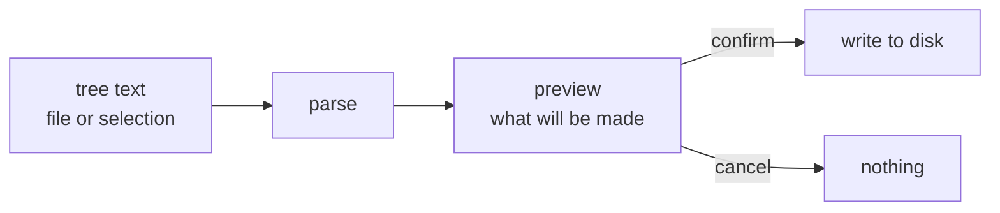

# create.tre

vscode extension. write a tree like this:

```
ollama_bpy_assistant/
├── __init__.py          # bl_info + register/unregister
├── panel.py             # UI definitions
├── operators.py         # Generate / Execute / Clear actions
├── ollama_client.py     # HTTP + threading
├── safety.py            # Forbidden-pattern filter
└── ARCHITECTURE.md      # this file
```

right-click → "create from tree" → those files and folders exist on disk. empty.

works on `.tre` files, or on selected text in any file (handy for trees inside markdown).

## why

i keep writing trees in readmes and design docs and then manually `mkdir`/`touch`ing every line. one right-click should fix that.

## flow



parser needs to handle:

- indent depth (every 4 spaces or one `│   ` = one level)
- tree-drawing chars: ├ └ │ ─
- `#` comments stripped from each line
- trailing `/` means directory, otherwise file

## planned layout

```
create.tre/
├── package.json
├── src/
│   ├── extension.ts     # entry, commands
│   ├── parser.ts        # tree text → file list
│   └── preview.ts       # webview before creating
├── syntaxes/
│   └── tre.tmLanguage.json
└── README.md
```

nothing built yet. just the idea.

## todo

- [ ] parser
- [ ] right-click on `.tre` file → create
- [ ] right-click on selection in any file → create
- [ ] preview pane before writing anything
- [ ] syntax highlighting for `.tre` files
- [ ] refuse to overwrite existing files unless forced
- [ ] reverse: folder → tree (maybe later)

## notes to self

- preview is the important part. don't auto-create anything ever.
- the tree format is ambiguous when a dir has no children shown. pick a rule and document it.
- mixed unicode spaces in pasted trees will probably bite me. test with copy-pasted output from `tree` and `ls`.